# Finance MLOps High-Level Design

## Goals

- Build a reproducible fraud-detection platform from synthetic source generation through serving.
- Keep data engineering, model training, and deployment concerns cleanly separated.
- Support both batch/streaming feature processing and low-latency online inference.

## System Architecture

```mermaid
flowchart LR
    dataGen[DataGenerator] --> bronze[LakehouseBronze]
    bronze --> silver[LakehouseSilver]
    silver --> gold[LakehouseGold]
    gold --> featureStore[FeatureStore]
    featureStore --> mlTables[MLTrainingTables]
    mlTables --> training[TrainingPipeline]
    training --> registry[MLflowRegistry]
    registry --> exportJob[ServingArtifactExport]
    exportJob --> predictorImage[KServePredictorImage]
    predictorImage --> kserveService[KServeInferenceService]
```

## Component Responsibilities

- `src/finance_mlops/data_generator`: synthetic offline and streaming financial events.
- `src/finance_mlops/pipelines/lakehouse`: bronze/silver/gold transformations and feature materialization.
- `src/finance_mlops/pipelines/training`: model train/evaluate/register/export lifecycle with MLflow.
- `src/finance_mlops/pipelines/inference/online_kserve`: FastAPI predictor contract for KServe.
- `src/finance_mlops/pipelines/inference/batch_streaming`: streaming fraud scoring over Delta events.
- `orchestration/airflow/dags`: scheduled orchestration for lakehouse and ML retraining workflows.
- `deploy/docker` and `deploy/k8s`: build/deploy manifests for serving runtime.

## Data Contracts

- **Source artifacts:** parquet and JSONL under `artifacts/source`.
- **Lakehouse tables:** Delta tables under `artifacts/lakehouse/{bronze,silver,gold}`.
- **Training dataset:** `ml_fraud_detection_training` in Gold.
- **Model registry:** MLflow local tracking at `artifacts/mlruns`.
- **Serving bundle:** exported model package at `artifacts/serving/fraud_detection_model/<version>`.
- **Online API contract:** request payload with `instances`; response includes `fraud_score`, `is_blocked`, `model_version`.

## Deployment View

- **Local dev:** run modules directly (`python -m finance_mlops...`) with artifact paths from `finance_mlops.config.paths`.
- **Airflow:** executes Python callables from installed package, no machine-specific absolute paths.
- **Online serving:** Docker image (`deploy/docker/kserve-predictor.Dockerfile`) bundles source and serving artifacts.
- **Kubernetes:** KServe `InferenceService` from `deploy/k8s/kserve/overlays/dev`.

## Operations

- Freshness targets: Gold <= 30 minutes, offline features <= 60 minutes, streaming features <= 5 minutes.
- Promotion gate: model is promoted only when validation PR-AUC passes threshold.
- Rebuild serving image whenever model version is updated.
- Keep runtime outputs out of Git; `artifacts/` is the canonical local runtime root.
