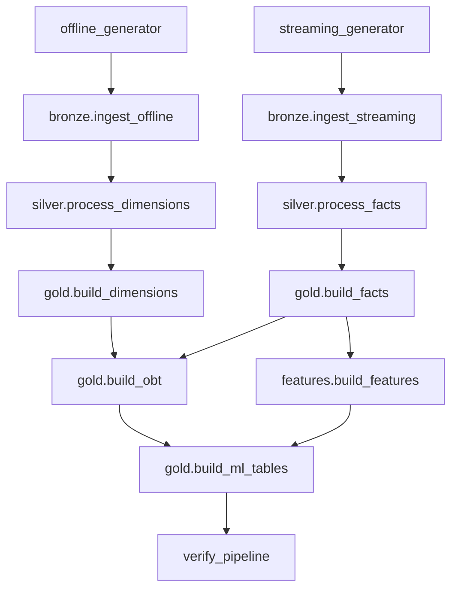
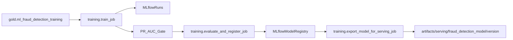

# Finance MLOps Low-Level Design

## Scope

This document describes implementation-level architecture: package boundaries, module responsibilities, runtime flow, and key technical contracts.

## Codebase Module Map

```text
src/finance_mlops/
├── config/
│   └── paths.py
├── data_generator/
│   ├── config.py
│   ├── main.py
│   ├── offline_generator.py
│   ├── streaming_generator.py
│   └── quality_report.py
└── pipelines/
    ├── common/utils/spark.py
    ├── lakehouse/
    │   ├── bronze/{ingest_offline.py, ingest_streaming.py}
    │   ├── silver/{process_dimensions.py, process_facts.py}
    │   ├── gold/{build_dimensions.py, build_facts.py, build_obt.py, build_ml_tables.py}
    │   ├── features/build_features.py
    │   └── verify_pipeline.py
    ├── training/
    │   ├── constants.py
    │   ├── inference_contract.py
    │   ├── train_job.py
    │   ├── evaluate_and_register_job.py
    │   ├── export_model_for_serving_job.py
    │   └── services.py
    └── inference/
        ├── batch_streaming/streaming_scoring_job.py
        └── online_kserve/predictor.py
```

## Runtime Path Resolution

All runtime data paths are centralized in `finance_mlops.config.paths`:

- `ARTIFACTS_ROOT` (`FINANCE_MLOPS_ARTIFACTS` override supported)
- Lakehouse roots:
  - `LAKEHOUSE_BRONZE_DIR`
  - `LAKEHOUSE_SILVER_DIR`
  - `LAKEHOUSE_GOLD_DIR`
- Data source roots:
  - `SOURCE_OFFLINE_DIR`
  - `SOURCE_STREAMING_DIR`
- Model/report roots:
  - `MLRUNS_DIR`
  - `REPORTS_DIR`
  - `SERVING_ROOT`

This avoids hardcoded machine-specific absolute paths in jobs and DAGs.

## Lakehouse Processing Flow (Low-Level)



## Training Pipeline Internals



- `train_job.py`:
  - loads training table from Gold
  - performs time-based split
  - trains XGBoost with imbalance handling
  - logs metrics/model to MLflow
- `evaluate_and_register_job.py`:
  - reads latest completed run
  - applies PR-AUC threshold gate
  - promotes model version to `Production` when passed
  - writes evaluation report to `artifacts/reports/ml_eval_report.json`
- `export_model_for_serving_job.py`:
  - downloads Production model artifacts
  - writes serving package under `artifacts/serving/...`
  - supports optional S3/MinIO sync

## Online Inference Internals (KServe Predictor)

`online_kserve/predictor.py` exposes:

- `GET /healthz`
- `GET /v1/models/fraud-detection`
- `POST /v1/models/fraud-detection:predict`

Load order:

1. Use `MODEL_DIR` if provided.
2. Else use `MODEL_ARTIFACT_URI` (supports `s3://...` download).
3. Else use `MODEL_VERSION`.
4. Else load latest local version under `SERVING_ROOT / MODEL_NAME`.

Prediction contract:

- Input: `{"instances": [dict | list]}`
- Validation/parsing via `training.inference_contract.parse_instances_payload`
- Output item format:
  - `fraud_score` (float)
  - `is_blocked` (bool)
  - `model_version` (string)

## Streaming Inference Internals

`inference/batch_streaming/streaming_scoring_job.py`:

- reads `transaction_auth` events from Bronze Delta
- joins account feature vectors from Gold
- loads Production model from MLflow
- applies model scoring in micro-batches
- writes scored events to `artifacts/lakehouse/gold/fraud_scores`

## Orchestration Boundaries

- `orchestration/airflow/dags/finance_lakehouse_dag.py` orchestrates generator + Bronze/Silver/Gold/Features.
- `orchestration/airflow/dags/finance_ml_training_dag.py` orchestrates ML table build + train + gate + register + export.
- DAG tasks call packaged modules directly (no legacy `jobs.*` imports).

## Deployable Units

- **Container**: `deploy/docker/kserve-predictor.Dockerfile`
  - installs package from `src`
  - includes serving artifacts under `/app/artifacts/serving`
- **KServe manifests**: `deploy/k8s/kserve`
  - base `InferenceService`
  - `overlays/dev` for environment-specific image/tag/path patching
